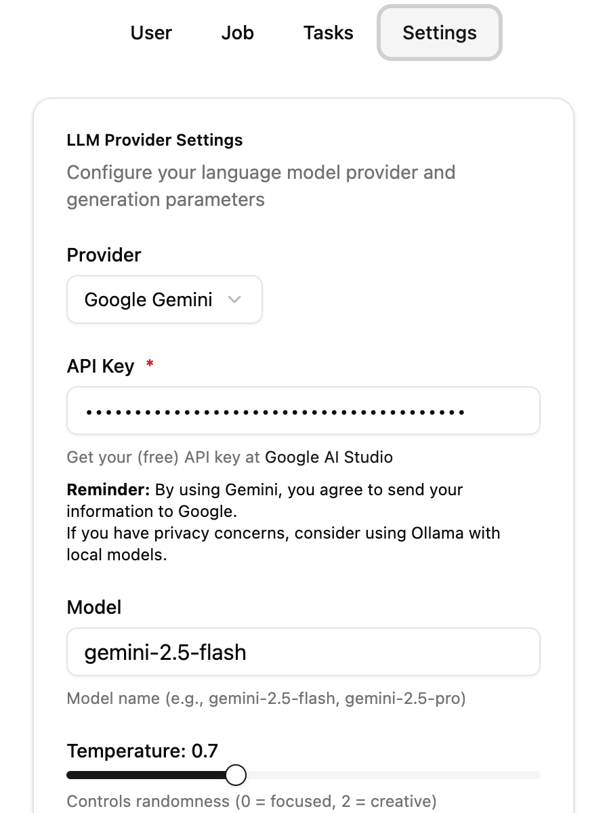
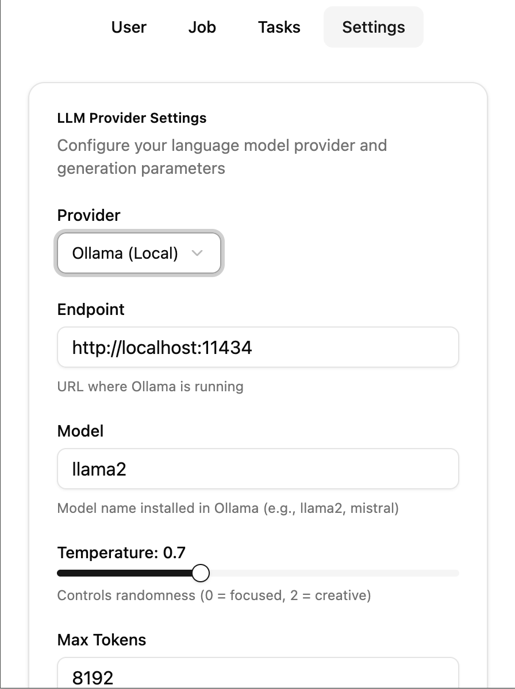
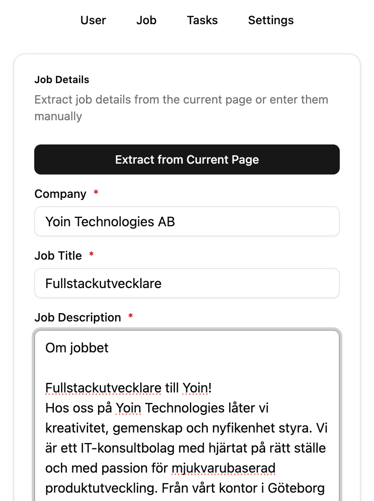
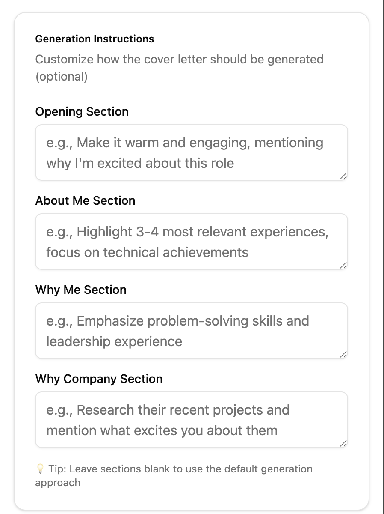
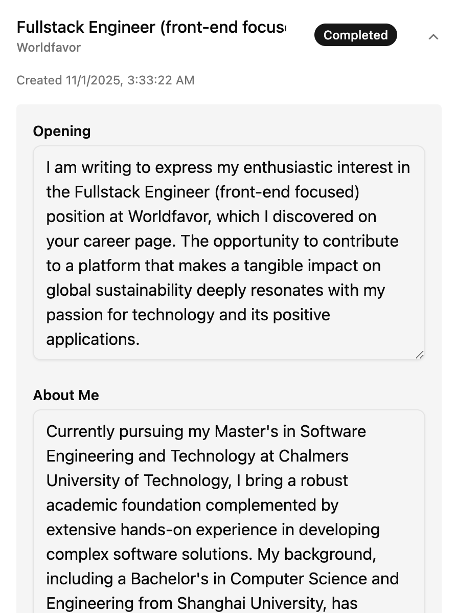
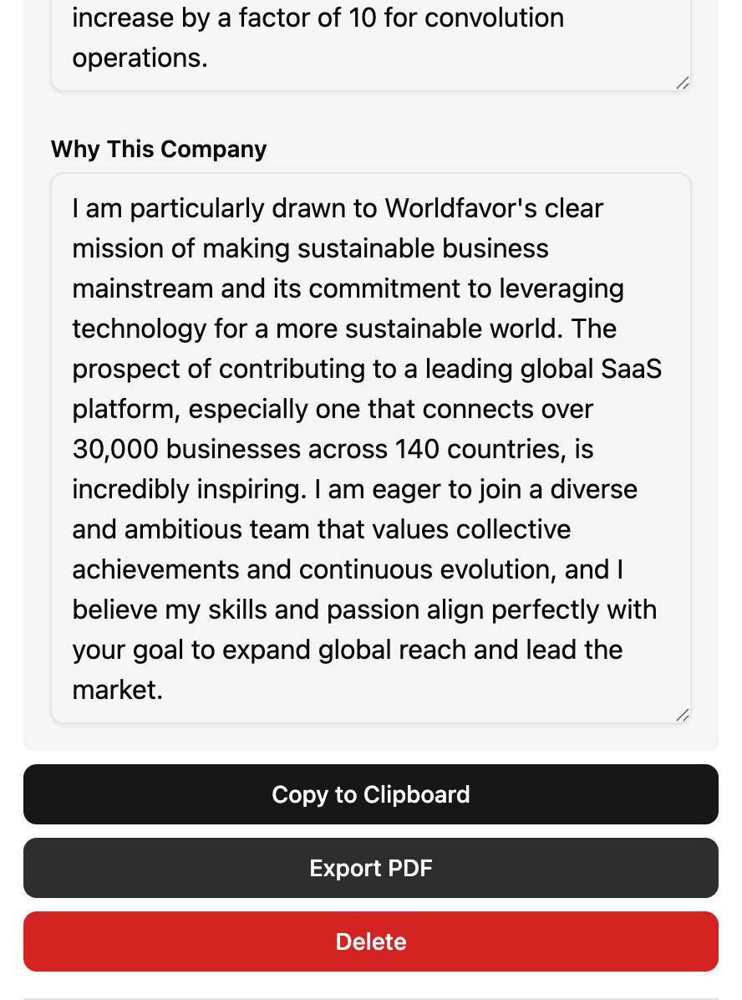
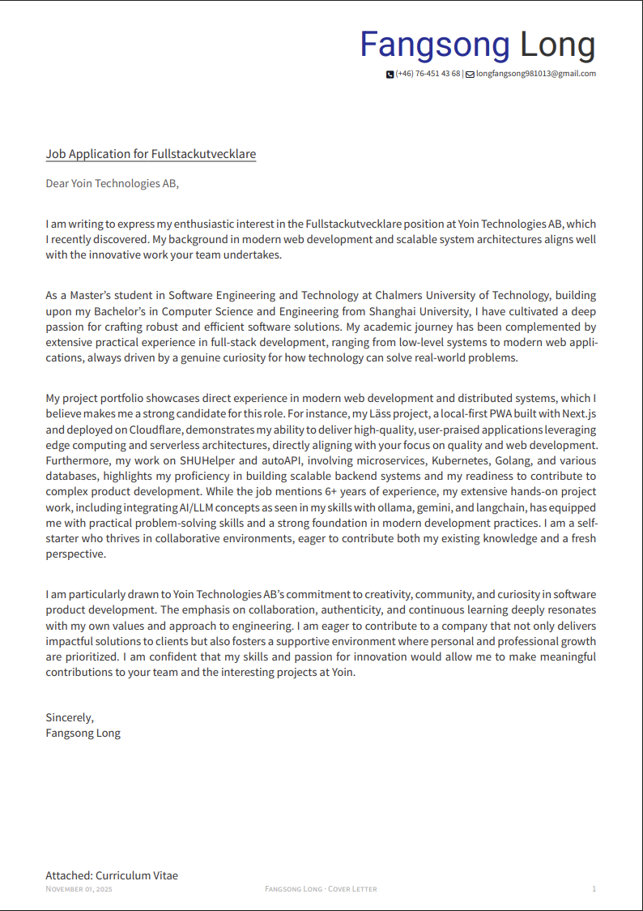

# AI Cover Letter Generator

Create stunning, personalized cover letters in seconds with this powerful browser extension. Effortlessly extract job details from LinkedIn, leverage your unique profile, and let AI craft professional cover letters tailored to every opportunity.

> **Note:** Always treat AI-generated content as a starting point. Nothing can replace your own words, experience, and personal touch. Review, edit, and make each cover letter truly yours!

## 🎯 Quick Start

https://github.com/user-attachments/assets/c0c6b10f-3087-47d4-aecd-0d637c04374e

### 1. Configure Your AI Provider

Get started by selecting your preferred AI provider in the **Settings** tab:

#### Option A: Gemini (Cloud, Free API Key Required)

1. Grab your free API key from [Google AI Studio](https://aistudio.google.com/apikey). Need help? Check this [video guide](https://www.youtube.com/watch?v=6BRyynZkvf0).
2. In the extension:
   - **Provider**: Gemini
   - **API Key**: Paste your key

#### Option B: Ollama (Local, Free)

Prefer to keep your data private? If you’re comfortable running models locally, [Ollama](https://ollama.com/) is a fantastic choice.

In the extension:

- **Provider**: Ollama
- **Endpoint**: `http://localhost:11434` (or your custom Ollama endpoint)
- **Model**: Your preferred model

### 2. Build Your Profile

Head to the **Profile** tab and choose your preferred method:

- **Manual Entry**: Enter your details by hand for full control.
- **PDF Upload**: Upload your resume and let AI extract your information automatically. Longer resumes may take up to a minute. You can always review and edit the extracted results!

**Required fields:**

- Name
- At least one skill
- At least one work experience or project

### 3. Extract Job Details

1. Browse to any LinkedIn job posting.
2. Open the extension popup on the job page.
3. Job details are auto-extracted for you—edit as needed!
4. If extraction doesn’t happen automatically, refresh the LinkedIn page and click **Extract from Current Page**.

### 4. Generate Your Cover Letter

1. Cover letters are crafted in four sections: opening, about you, why you’re a great fit, and why you want the company. You can add your own instructions for each section, emphasize your strengths or include extra details not in your resume!
   
   

2. Click **Start Cover Letter Generation**. The process runs in the background, so you can keep browsing jobs or start more generation tasks.

### 5. Edit & Export Your Cover Letter

1. Visit the **Tasks** page to see all your generated cover letters.
   
   

2. Once a task is marked **completed**, you can view, edit, and export your letter. Choose your export method:
   - **Copy to Clipboard**: Instantly copy your formatted letter.
   - **Export to PDF**: Download a polished, professional PDF.
   Both options automatically include a friendly greeting and closing for you.
   
   
   
